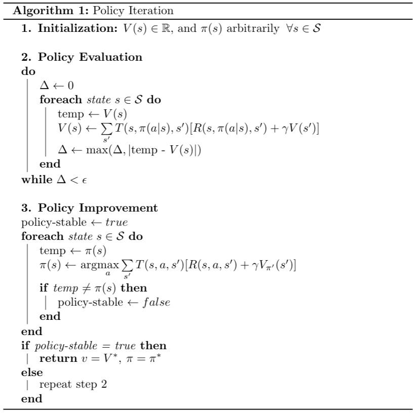
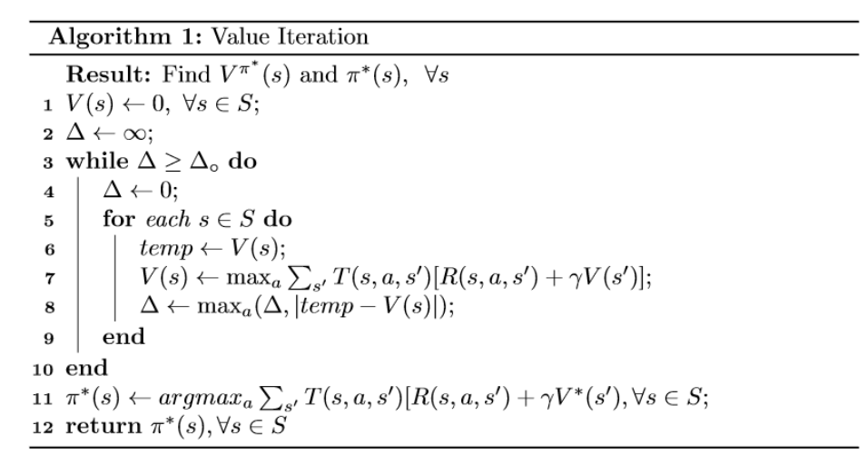
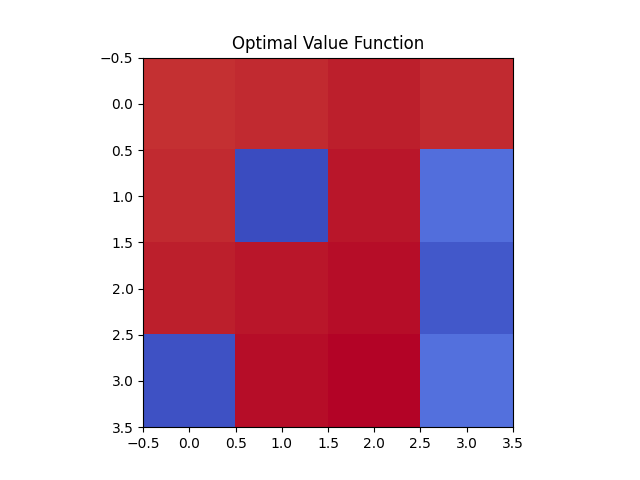
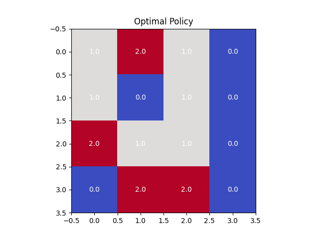
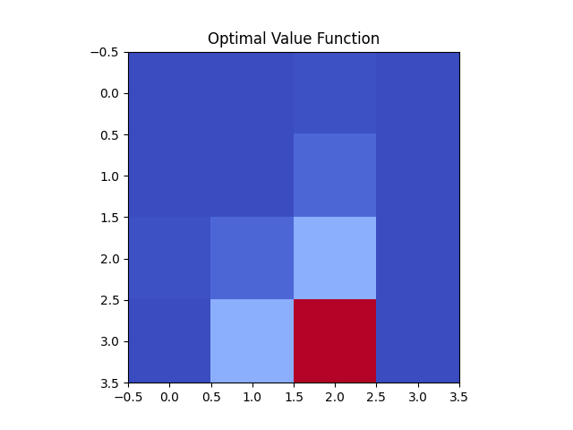

# Dynamic-Programming

This repository contains Python implementations of dynamic programming algorithms for solving the Bellman Equation in the `FrozenLake-v1` environment from OpenAI Gym.


These algorithms are widely used in reinforcement learning and optimal control problems, where an agent aims to find the optimal policy (sequence of actions) that maximizes the expected cumulative reward over time.

## Implementations

### Policy Iteration
An iterative method that alternates between policy evaluation and policy improvement steps to find the optimal policy and value function.



### Value Iteration
An iterative method that updates the value function directly by computing the maximum expected value over all possible actions, converging to the optimal value function.


## Requirements
This project requires Python 3.10 or higher.

## How to use:

1. Clone the repository:

```bash
git clone https://github.com/nicholasbaard/Dynamic-Programming.git
```

2. Install the required dependencies:

```bash
pip install requirements.txt
```

3. Run the main scripts:

These scripts will run the policy/value iteration algorithms on the `FrozenLake-v1` environment and plot the learned optimal value function and optimal policy.

```bash
cd src
python policy_iteration.py
python value_iteration.py
```
## Arguments

- `--show_policy`: Show policy
- `--max_iterations`: Maximum number of iterations for policy iteration (default: 10) [Only for policy_iteration.py]


# Results
This repository includes plots generated during the experiments using the default parameters. The plots can be found in the `plots` folder.

## Policy Iteration:



## Value Iteration:



# Contributing

Contributions are welcome! If you find any issues or have suggestions for improvements, please open an issue or submit a pull request.